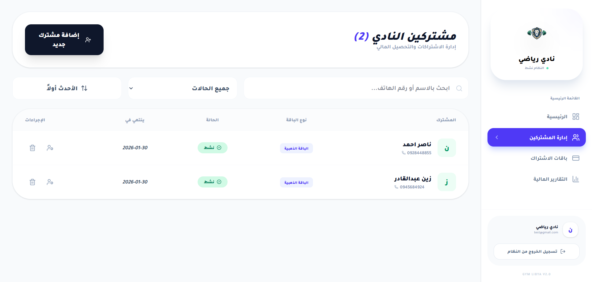

# ProGym Manager - SaaS Subscription Platform 🏋️‍♂️
A high-performance, Arabic-centric Management System for Gyms & Fitness Centers.

🌟 Overview
ProGym Manager is a production-ready SaaS solution designed to streamline gym operations. Built with a focus on User Experience (UX) and RTL (Right-to-Left) precision, it bridges the gap between complex management tools and non-technical business owners. It provides a centralized dashboard to track memberships, finances, and automated subscription lifecycles.

🚀 Key Features
Intelligent Dashboard: Real-time analytics for active memberships, monthly revenue, and upcoming expirations.

Seamless RTL Interface: Built from the ground up for the Arabic language with a professional UI using Tailwind CSS.

Subscription Lifecycle Management: Automated calculation of expiry dates and one-click renewal system.

Proactive Alerts: Visual notification system for memberships expiring within a 3-day window.

Multi-tenant Architecture: Secure data isolation ensuring each gym owner accesses only their specific business data.

Performance Optimized: Leveraging Next.js 15 App Router for lightning-fast navigation and server-side efficiency.

🛠️ Tech Stack
Frontend: Next.js 15 (React), Tailwind CSS, Shadcn UI.

Icons: Lucide-React.

Backend & Auth: Supabase (PostgreSQL).

State Management: React Hooks & Context API.

📈 Business Logic & Impact
Eliminates Human Error: Replaces manual ledgers with automated date tracking.

Data-Driven Decisions: Provides gym owners with financial forecasts based on active plans.

High Convertibility: Designed with a "Zero-Learning Curve" for non-technical users.

🔗 Live Demo & Links
Live Preview: https://gymlibya.vercel.app/

email : test@gmail.com
password : test@gmail.com

Contact for Business: https://www.linkedin.com/in/mohammedyounusdev
